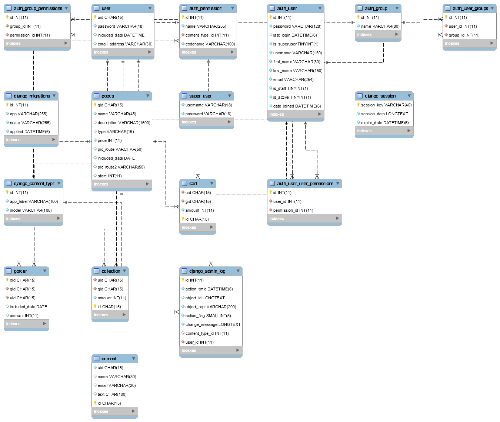

# final-assignment
## db的er图 ##

##运行配置
 * 配置iis服务器（记得在asp选项中把“启用父路径”打开）
 * 安装mysql-odbc-connector并配置odbc
 * 在other/odbc.ini文件中填写你的db信息
 * 将网站复制到你的asp文件夹下
##2018-5-19
 1. 实现了从数据库显示商品到页面  
 2. 后台的登录页面、  

